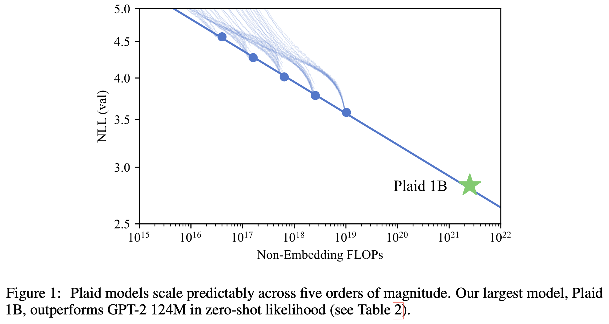

# Plaid: Likelihood-Based Diffusion Language Models

This repository contains code for training and evaluating the models in the paper *Likelihood-Based Diffusion Language Models*.



## Installing requirements

This codebase requires PyTorch 2.0 and a few fused CUDA kernels that need to be installed manually. Most of the dependencies can be installed automatically:
```
pip install -r requirements.txt
```

Install FlashAttention with fused MLP and rotary embedding kernels:
```
git clone https://github.com/HazyResearch/flash-attention.git
pip install flash-attention
pip install flash-attention/csrc/rotary
pip install flash-attention/csrc/fused_dense_lib
```

Install NVIDIA Apex with fused kernels:
```
git clone https://github.com/NVIDIA/apex
cd apex
pip install -v --disable-pip-version-check --no-cache-dir --global-option="--cpp_ext" --global-option="--cuda_ext" ./
```

## Generating samples from Plaid 1B

First download the weights from here: [Plaid 1B Weights Download Page](https://github.com/igul222/plaid/releases/tag/v1.0.0)

Extract them:
```
cat plaid1b_weights.tar.gz.* | tar xvzf -
```

Then run the sampling code:

```
python sample.py --weights_path=/path/to/plaid1b_weights --dim=2048 --n_blocks=24 --n_heads=32 --seq_len=1024
```

## Computing zero-shot likelihoods

This repository supports computing zero-shot likelihoods on six datasets: Penn TreeBank, enwik8, text8, WikiText2, WikiText103, and the 1 Billion Word corpus.
To compute likelihood for one of these datasets, specify the dataset path in the corresponding constant at the top of `lib/datasets.py`. Then run this command (e.g. for WikiText103):

```
python train.py --weights_path=/path/to/plaid1b_weights --dim=2048 --n_blocks=24 --n_heads=32 --seq_len=1024 --dataset=wikitext103
```

## Training Plaid models

1. Download OpenWebText2 from here: [OpenWebText2 Download](https://mystic.the-eye.eu/public/AI/pile_preliminary_components/openwebtext2.jsonl.zst.tar).
2. Update the `OPENWEBTEXT2_DATA_DIR` constant in `lib/datasets.py` with the path to the extracted files.
3. Run the OpenWebText2 preprocessing script:
   ```
   python -m misc.owt2_preprocess --data_dir=/path/to/openwebtext2
   ```
4. Run the training script:
   ```
   python train.py
   ```

By default, this trains a small model (16 layers, dim 384, sequence length 256, 92K steps at batch size 256) which should take under a day on an 80GB A100. You can change these hyperparameters by passing different options to `train.py`.
   
If you don't have enough memory to train the model with default settings, you can enable gradient accumulation. The following commands should produce equivalent results:
```
python train.py # defaults to grad_accum_steps=1, batch_size=256
python train.py --grad_accum_steps=2 --batch_size=128
python train.py --grad_accum_steps=4 --batch_size=64
```
